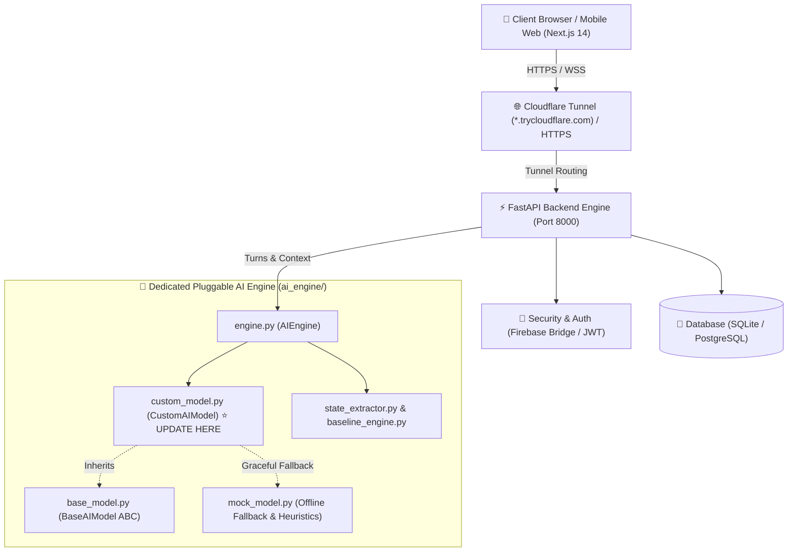
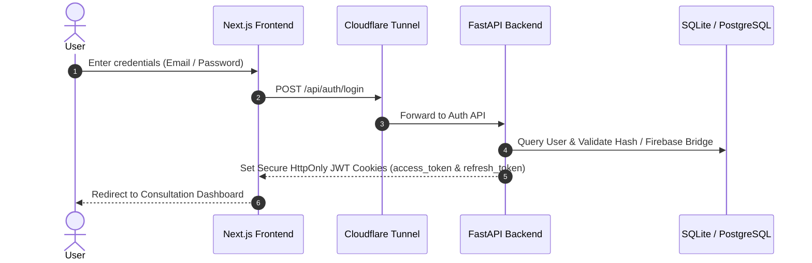
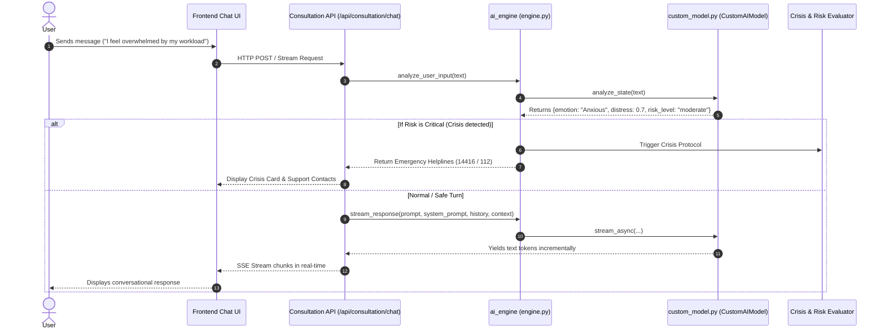

# 🏗️ Mythri System Architecture (Post-Cleanup & AI Engine Reorganization)

This document provides an end-to-end architectural guide of the Mythri platform after stripping hardcoded API keys and reorganizing the AI inference pipeline into a dedicated, pluggable **`ai_engine/`** directory.

---

## 📌 Executive Summary: What Changed?

| Component | Status | Description |
| :--- | :--- | :--- |
| **API Keys & Secrets** | 🔒 **Sanitized** | All proprietary API keys (Sarvam, OpenRouter, Hugging Face, Firebase tokens, Nvidia keys, NeonDB credentials) were removed from `.env` and `.env.local` and replaced with safe environment placeholders. |
| **Cloudflare Authentication & Tunneling** | 🌐 **Retained** | Cloudflare origins, CORS regex policies, tunnel hostnames (`*.trycloudflare.com`), and service worker dev origins were strictly preserved for login and secure tunneling. |
| **AI Engine Reorganization** | 🧠 **Centralized & Modular** | Created a dedicated, standalone **`ai_engine/`** package with a plug-and-play `CustomAIModel` interface where you can drop in any Hugging Face model, PyTorch checkpoint, vLLM / Ollama server, or custom inference script in one file. |
| **Fallback Engine** | 🛡️ **Zero-Crash Safety** | Added `MockAIModel` with heuristic emotion detection and crisis interceptors so the system runs smoothly even without active GPU weights or API keys. |

---

## 🏛️ High-Level System Architecture



---

## 🔐 Cloudflare & Authentication Architecture

### 1. Cloudflare Login & Tunnels
- The Next.js frontend connects to the backend through Cloudflare tunnels (e.g. `*.trycloudflare.com` or custom domains).
- `frontend/next.config.js` configures `allowedDevOrigins` and API proxy rewrites (`/api/:path* -> http://127.0.0.1:8000/api/:path*`).
- `backend/app.py` accepts Cloudflare host headers via `TrustedHostMiddleware` and matches origin regex `https://.*\.trycloudflare\.com`.

### 2. Authentication Flow


---

## 🧠 The Pluggable `ai_engine/` Directory

All model inference, state analysis, and emotion classification are now centralized inside the **`ai_engine/`** directory.

```
ai_engine/
├── __init__.py           # Package exports (AIEngine, CustomAIModel, BaseAIModel, etc.)
├── base_model.py         # Abstract Base Class defining required methods
├── custom_model.py       # ⭐️ YOUR MODEL FILE: Update this file to plug in your model
├── mock_model.py         # Zero-dependency heuristic fallback model
├── engine.py             # Main AIEngine orchestrator singleton
├── config.py             # Hyperparameters, model paths, and device settings
├── baseline_engine.py    # Tracks user distress/arousal baseline over time
├── concern_tracker.py    # Tracks clinical concerns across conversations
├── ranking_algorithm.py  # Prioritizes core vs. secondary user concerns
├── state_extractor.py    # Validates 10-parameter user psychological state
└── README.md             # Developer quickstart guide
```

---

## 🛠️ How to Update & Plug in Your Own Model

Open **`ai_engine/custom_model.py`**. You only need to update the `CustomAIModel` class!

### Method 1: Local Hugging Face / PyTorch Checkpoint
```python
# In ai_engine/custom_model.py
from transformers import AutoModelForCausalLM, AutoTokenizer, pipeline
import torch
from .base_model import BaseAIModel

class CustomAIModel(BaseAIModel):
    def __init__(self, config=None):
        self.config = config or default_model_config
        model_id = self.config.model_name_or_path  # e.g. "Qwen/Qwen3-32B" or local folder
        self.tokenizer = AutoTokenizer.from_pretrained(model_id)
        self.pipe = pipeline(
            "text-generation",
            model=model_id,
            tokenizer=self.tokenizer,
            device_map="auto",
            torch_dtype=torch.float16
        )

    def generate(self, prompt: str, **kwargs) -> str:
        output = self.pipe(prompt, max_new_tokens=256)
        return output[0]["generated_text"]
```

### Method 2: Local Server (Ollama / vLLM / llama.cpp)
```python
# In ai_engine/custom_model.py
from openai import AsyncOpenAI
from .base_model import BaseAIModel

class CustomAIModel(BaseAIModel):
    def __init__(self, config=None):
        self.config = config or default_model_config
        # Connect to your local Ollama / vLLM server
        self.client = AsyncOpenAI(
            base_url="http://localhost:11434/v1",  # or http://localhost:8000/v1
            api_key="none"
        )

    async def generate_async(self, prompt: str, system_prompt: str = None, **kwargs) -> str:
        messages = []
        if system_prompt:
            messages.append({"role": "system", "content": system_prompt})
        messages.append({"role": "user", "content": prompt})

        res = await self.client.chat.completions.create(
            model="my-custom-model",
            messages=messages,
            temperature=0.7
        )
        return res.choices[0].message.content
```

### Method 3: Cloud / External API Endpoint
```python
# In ai_engine/custom_model.py
import os
from openai import AsyncOpenAI
from .base_model import BaseAIModel

class CustomAIModel(BaseAIModel):
    def __init__(self, config=None):
        self.config = config or default_model_config
        self.client = AsyncOpenAI(
            base_url=self.config.api_base_url or "https://openrouter.ai/api/v1",
            api_key=os.getenv("MAITRI_OPENROUTER_API_KEY", "")
        )
```

---

## 🔄 End-to-End Turn Lifecycle



---

## 📋 Environment Variables Summary

Set these in `backend/.env` or pass them via environment:

| Variable | Default Value | Purpose |
| :--- | :--- | :--- |
| `DATABASE_URL` | `sqlite:///./maitri.db` | Main SQL database connection URL. |
| `SECRET_KEY` | `dev_secret_key_...` | Minimum 32-character secret key for JWT session cookies. |
| `AI_MODEL_PROVIDER` | `custom` | Active model provider (`custom`, `huggingface`, `ollama`, `vllm`, `mock`). |
| `AI_MODEL_NAME_OR_PATH` | `Qwen/Qwen3-32B` | Identifier or file path to your custom model weights. |
| `AI_DEVICE` | `cpu` | Target inference device (`cuda`, `cpu`, `mps`). |
| `AI_TEMPERATURE` | `0.7` | Generation sampling randomness. |
| `AI_MAX_TOKENS` | `512` | Maximum generated tokens per turn. |
| `AI_API_BASE_URL` | `None` | Endpoint URL if connecting to a remote/local server. |
| `AI_API_KEY` | `None` | Optional API Key for model inference server. |

---

## 🧪 Testing Your Setup

Test the new AI Engine and model interface directly from your terminal:

```bash
# 1. Test basic generation
python -c "from ai_engine import ai_engine; import asyncio; print(asyncio.run(ai_engine.generate_response('Hello!')))"

# 2. Test emotion & safety analysis
python -c "from ai_engine import ai_engine; print(ai_engine.analyze_user_input('I am feeling very anxious'))"
```
